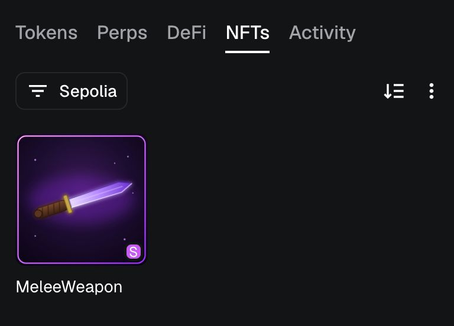
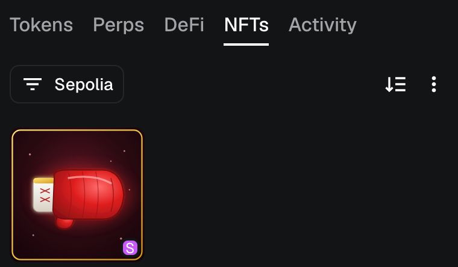

# MeleeWeapon NFT

A fully on-chain ERC721 NFT built with [Foundry](https://book.getfoundry.sh/). Each token stores its metadata and artwork entirely on-chain — no IPFS, no external hosting. Every NFT can be switched between three melee weapon skins: **Pistol**, **Knife**, and **Boxing Glove**.

Deployed on Sepolia: [`0x8a6906cff9bbc69464e74c0b16838727476597f4`](https://sepolia.etherscan.io/address/0x8a6906cff9bbc69464e74c0b16838727476597f4)

### Live in MetaMask

The on-chain SVG renders directly in a wallet — no metadata server, no IPFS gateway, just `tokenURI` decoded straight from the contract.

<table>
<tr>
<td><br/>Freshly minted — default <b>Knife</b> skin</td>
<td><br/>After <code>switchMelee</code> — cycled to <b>Boxing Glove</b></td>
</tr>
</table>

## How it works

- `MeleeWeapon` ([src/MeleeWeaponNFT.sol](src/MeleeWeaponNFT.sol)) is an ERC721 contract that mints tokens starting with the **Knife** skin.
- Each weapon's SVG artwork is base64-encoded and embedded directly in the `tokenURI` as a `data:` URI — the JSON metadata (name, description, attributes, image) is also base64-encoded and returned on-chain via `tokenURI(tokenId)`.
- The token owner (or an approved address) can call `switchMelee(tokenId)` to cycle the NFT's skin: Pistol → Knife → Boxing Glove → Pistol.
- `ImageURIHelper` ([src/ImageURIHelper.sol](src/ImageURIHelper.sol)) is a small library that base64-encodes raw SVG into a `data:image/svg+xml;base64,...` URI.
- The three SVGs live in [imgs/](imgs/) and are read at deploy time by the deploy script, then baked into the contract's constructor.

## Project structure

```
src/
  MeleeWeaponNFT.sol       ERC721 contract with on-chain metadata + skin switching
  ImageURIHelper.sol       SVG -> base64 data URI helper library
script/
  DeployMeleeWeaponNFT.s.sol   Deploys MeleeWeapon, wiring in the three SVGs from imgs/
  Interactions.s.sol           MintMeleeWeaponNFT / SwitchMeleeMeleeWeaponNFT scripts
test/
  unit/                   Unit tests for MeleeWeapon
  integration/             Integration tests (deploy + mint + switch flows)
  helpers/                 Test helpers (e.g. ImageURI)
imgs/
  pistol.svg, knife.svg, boxing_glove.svg   Source artwork
  *.json                                     Reference metadata for each weapon
```

## Requirements

- [Foundry](https://book.getfoundry.sh/getting-started/installation) (`forge`, `cast`, `anvil`)
- `make` (all common workflows are wrapped in the [Makefile](Makefile))

## Setup

```shell
git clone <this-repo>
cd onchain-nft
make install   # forge install (git submodules: forge-std, openzeppelin-contracts)
make build
```

Create a `.env` file for anything beyond local Anvil usage. Note that no private key ever goes in `.env` — see [Wallet setup](#wallet-setup) below.

```shell
SEPOLIA_RPC_URL=<your_rpc_url>
ETHERSCAN_API_KEY=<your_etherscan_api_key>
```

### Wallet setup

Real-network scripts (deploy/mint/switch on Sepolia, etc.) never take a raw private key on the command line or in `.env`. Instead they use Foundry's encrypted keystore via `cast wallet`:

```shell
make wallet-import ACCOUNT=my-account   # prompts for your private key + a keystore password, once
```

This stores an encrypted keystore under `~/.foundry/keystores/my-account`. Every subsequent script run references it by name and prompts for the keystore password interactively at broadcast time — the key itself is never written to disk in plaintext or passed as a flag.

Local Anvil usage is unaffected: `make anvil`/`make deploy` (no `ARGS`) use Anvil's well-known, public test key, which is safe to hardcode since it only ever controls funds on your local chain.

## Usage

All common commands are defined in the [Makefile](Makefile):

| Command | Description |
|---|---|
| `make build` | Compile contracts |
| `make test` | Run the test suite |
| `make format` | Format Solidity with `forge fmt` |
| `make snapshot` | Generate gas snapshots |
| `make anvil` | Start a local Anvil node (deterministic test mnemonic) |
| `make clean` | Clean build artifacts |
| `make install` / `make update` | Install / update dependencies |

### Deploy

Local (Anvil), no extra args needed — defaults to `http://localhost:8545` with the well-known Anvil test key:

```shell
make anvil          # in one terminal
make deploy          # in another
```

Sepolia testnet, using the `ARGS` variable to opt into the network-specific RPC/verification settings, plus `ACCOUNT`/`SENDER` for the encrypted keystore set up above:

```shell
make deploy ARGS="--network sepolia" ACCOUNT=my-account SENDER=0xYourAddress
```

You'll be prompted for the keystore password at broadcast time. This runs [script/DeployMeleeWeaponNFT.s.sol](script/DeployMeleeWeaponNFT.s.sol), which reads the three SVGs from `imgs/` and deploys `MeleeWeapon` with them baked in.

### Mint an NFT

```shell
make mint                              # uses the most recent broadcast to find the deployed address
make mint ARGS="--network sepolia" ACCOUNT=my-account SENDER=0xYourAddress
```

Or point at a specific deployment via env var:

```shell
MELEE_WEAPON_ADDRESS=0x... make mint
```

### Switch a weapon skin

`SwitchMeleeMeleeWeaponNFT.run` takes a `tokenId`, so pass it via `TOKEN_ID` (the Makefile forwards it to forge script's `--sig "run(uint256)"`):

```shell
make switch TOKEN_ID=0
make switch TOKEN_ID=0 ARGS="--network sepolia" ACCOUNT=my-account SENDER=0xYourAddress
```

Or point at a specific deployment via env var, same as `mint`:

```shell
MELEE_WEAPON_ADDRESS=0x... make switch TOKEN_ID=0
```

## Testing

```shell
make test
```

Tests are split into:
- **unit** — direct contract behavior (minting, switching, tokenURI encoding, authorization checks)
- **integration** — full deploy + mint + switch flows via the scripts

## License

MIT
